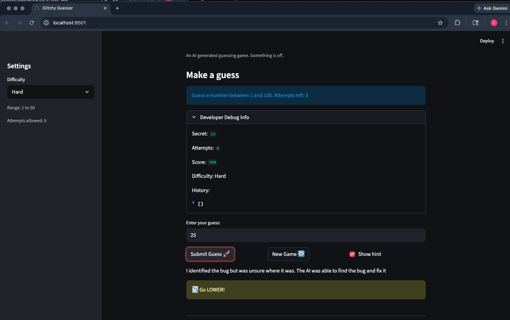

# 🎮 Game Glitch Investigator: The Impossible Guesser

## 🚨 The Situation

You asked an AI to build a simple "Number Guessing Game" using Streamlit.
It wrote the code, ran away, and now the game is unplayable. 

- You can't win.
- The hints lie to you.
- The secret number seems to have commitment issues.

## 🛠️ Setup

1. Install dependencies: `pip install -r requirements.txt`
2. Run the broken app: `python -m streamlit run app.py`

## 🕵️‍♂️ Your Mission

1. **Play the game.** Open the "Developer Debug Info" tab in the app to see the secret number. Try to win.
2. **Find the State Bug.** Why does the secret number change every time you click "Submit"? Ask ChatGPT: *"How do I keep a variable from resetting in Streamlit when I click a button?"*
3. **Fix the Logic.** The hints ("Higher/Lower") are wrong. Fix them.
4. **Refactor & Test.** - Move the logic into `logic_utils.py`.
   - Run `pytest` in your terminal.
   - Keep fixing until all tests pass!

## 📝 Document Your Experience

- [ ] Describe the game's purpose.
- [ ] Detail which bugs you found.
- [ ] Explain what fixes you applied.

Answer:
The game's purpose is to be a simple number guessing game. Depending on the difficulty selected,
there is a different range of numbers and different number of attempts. The user tries to guess
the secret number that the program generates.

While there were a couple of bugs that I found, there was two in particular I decided to fix.
The first bug had to do with hints. The game was giving the wrong hints in that it told the
user to guess a lower number when the user should guess a higher number and vice versa.
The second bug dealt with new games. After getting a correct guess or running out of attemps,
the user was not able to input any new numbers after starting a new game.

The fixes that I applied was working with the AI to change the hints to the proper higher or lower. 
Along the way, it found an interesting bug where on even attempts, the number was being passed as 
a string type instead of integer. The AI fixed this bug too so it's always passed as a integer.
The second fixed I applied was changing the states and different variables inside when creating a new game. User can now play a new game with new attempts. The AI helped me with the logic as I wasn't too familiar on how to actually implement that code.

My screenshot shows both fixes. The hint is now correct, and because I can play multiple games now, the score reads 300.

## 📸 Demo

## 🚀 Stretch Features

- [x] **Challenge 3: Professional Documentation and Linting** — Added Google-style docstrings with Args, Returns, and Raises sections to every function in `logic_utils.py`. Reviewed both `logic_utils.py` and `app.py` for PEP 8 compliance and resolved all violations (line length, blank lines, trailing whitespace).
- [ ] [If you choose to complete Challenge 4, insert a screenshot of your Enhanced Game UI here]
